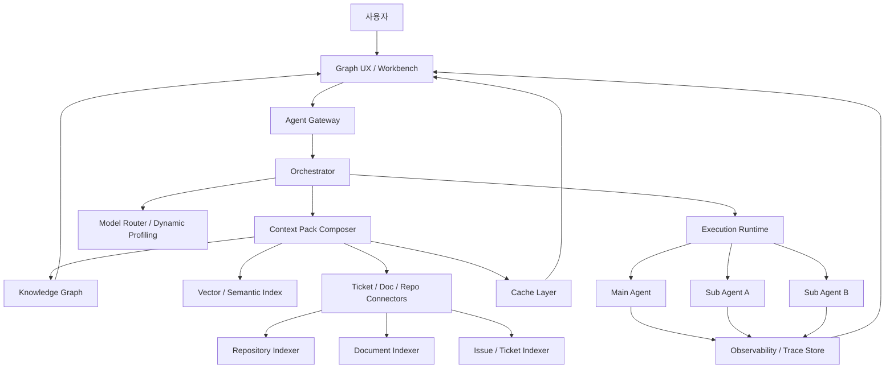

# 에이전트 컨텍스트 그래프 프레임워크 설계도

## 1. 한 줄 정의

이 프레임워크는 **세션 안에 기억을 쌓는 구조**가 아니라, **세션 밖의 그래프형 지식/작업 메모리**를 만들고 에이전트가 그때그때 필요한 맥락만 재조립해서 읽는 구조**이다.**

핵심 철학은 다음 한 문장으로 정리된다.

> **세션은 짧게, 상태는 프레임워크가 기억한다.**

---

## 2. 문제 정의

현재 에이전트 오케스트레이션의 병목은 다음과 같다.

1. 긴 세션을 유지할수록 컨텍스트가 압축되고 디테일이 유실된다.
2. 새 세션을 열면 이전 대화의 맥락이 사라져 다시 주입해야 한다.
3. 레포/문서/티켓을 매번 다시 검색하느라 토큰과 지연이 커진다.
4. 어떤 에이전트가 무엇을 참고해서 어떤 결론을 냈는지 UX에서 보이지 않는다.
5. 메인 에이전트 1개만 쓰는 경우와, 여러 모델/여러 에이전트를 혼합하는 경우를 하나의 구조로 품기 어렵다.

이 프레임워크는 이 문제를 해결하기 위해 **RAG + 그래프 메모리 + 세션 핸드오프 + 캐시 + 시각화된 오케스트레이션 UI**를 결합한다.

---

## 3. 설계 목표

### 목표
- 새 세션에서도 필요한 맥락을 자동 재구성한다.
- 레포, 문서, 티켓, 결정사항, 템플릿을 **노드/엣지 그래프**로 저장한다.
- 의미 기반 검색 + 관계 기반 확장으로 최소 토큰으로 최대 관련 맥락을 가져온다.
- 단일 메인 에이전트 모드와 멀티 에이전트 모드를 모두 지원한다.
- 어떤 에이전트가 어떤 컨텍스트를 읽고 어떤 작업을 했는지 UI에서 추적 가능하게 한다.
- 프롬프트/검색/응답/요약/그래프 확장 단위까지 캐싱한다.
- 모델별 비용, 지연, 정확도를 기반으로 동적 라우팅한다.

### 비목표
- 대화 전문을 무한히 기억하는 메신저형 메모리 시스템을 만들지 않는다.
- 모든 과거 메시지를 다시 넣는 방식으로 문제를 해결하지 않는다.
- 그래프만으로 모든 검색을 해결하지 않는다. 그래프는 **연결성**, 벡터 검색은 **의미 유사도**, 키워드 검색은 **정확한 회수** 역할을 맡는다.

---

## 4. 핵심 컨셉

### 4.1 세션과 메모리를 분리한다
- **세션**: 추론이 일어나는 휘발성 실행 공간
- **프레임워크 메모리**: 세션 밖에 존재하는 영속 상태

즉, 에이전트는 기억하지 않아도 된다. 대신 프레임워크가 다음을 기억한다.
- 현재 작업 목표
- 최근 결정사항
- 중요 아티팩트
- 관련 파일/문서/티켓의 위치와 연결
- 검증된 요약과 템플릿
- 이전 실행 결과와 실패 패턴

### 4.2 컨텍스트를 “문장”이 아니라 “노드 묶음”으로 본다
컨텍스트를 단순한 긴 프롬프트가 아니라 다음 조합으로 취급한다.
- 핵심 목표 요약
- 관련 노드들
- 노드 사이 엣지(시냅스)
- 증거 스니펫
- 실행 제약
- 현재 세션용 작업 템플릿

이를 **Context Pack**이라 부른다.

### 4.3 사람처럼 연상하는 구조를 만든다
사용자 표현대로 핵심은 “노드가 시냅스로 연결되어 있기 때문에 관련 정보를 함께 가져오는 휴리스틱”이다.

예:
- `버그 티켓` 노드를 찾으면
- 연결된 `에러 로그`, `관련 모듈`, `최근 PR`, `테스트 실패`, `담당자 메모`, `과거 유사 이슈`가 따라온다.

즉 **semantic search로 시작하고 graph expansion으로 주변 맥락을 붙이는 구조**다.

---

## 5. 전체 아키텍처



---

## 6. 주요 컴포넌트

### 6.1 Agent Gateway
역할:
- 프레임워크와 각 에이전트/모델 간 1:1 인터페이스 제공
- 모델 공급자별 차이를 숨기는 어댑터 계층
- 단일 메인 에이전트 모드와 멀티 에이전트 모드를 동일 API로 노출

핵심 이유:
- 사용자 설명처럼 “인터페이스가 에이전트와 1대1 대응”되어야 각 에이전트의 작업/참조/상태를 UI에서 독립적으로 볼 수 있다.

예시 인터페이스:
- `run(agent_id, task, context_pack_id)`
- `resume(agent_id, run_id, handoff_pack_id)`
- `explain(agent_id, run_id)`
- `list_references(agent_id, run_id)`

### 6.2 Orchestrator
역할:
- 작업 분해
- 실행 순서/병렬성 결정
- 세션 전환 시점 결정
- 실패 재시도, 검증, 인간 승인 포인트 제어

오케스트레이터는 에이전트가 아니라 **상태 기계**에 가깝게 구현하는 것이 좋다.

권장 상태:
- `planned`
- `running`
- `waiting_tool`
- `waiting_human`
- `summarizing`
- `handoff_ready`
- `completed`
- `failed`

### 6.3 Context Pack Composer
이 프레임워크의 핵심 엔진이다.

입력:
- 현재 사용자 목표
- 현재 작업 타입
- 현재 세션 예산(토큰/비용/지연)
- 관련 노드 후보
- 최근 실행 이력

출력:
- 에이전트가 읽을 최소 컨텍스트 묶음

구성 예:
- Goal Summary
- Must-Know Facts
- Relevant Nodes Top-K
- Neighbor Expansion
- Evidence Snippets
- Constraints / Do-Not-Forget
- Suggested Template
- Open Questions / Blockers

### 6.4 Knowledge Graph
노드와 엣지로 구성된 영속 메모리.

#### 대표 노드 타입
- `Agent`
- `Session`
- `Run`
- `Task`
- `Decision`
- `Summary`
- `Template`
- `Repository`
- `CodeFile`
- `CodeSymbol`
- `Document`
- `DocSection`
- `Ticket`
- `PR`
- `Commit`
- `TestCase`
- `Error`
- `Artifact`
- `Person`
- `Policy`

#### 대표 엣지 타입
- `references`
- `derived_from`
- `implements`
- `depends_on`
- `related_to`
- `caused_by`
- `fixes`
- `mentions`
- `validated_by`
- `contradicts`
- `blocks`
- `handed_off_to`
- `used_template`
- `summarizes`

이때 엣지는 단순 연결이 아니라 **가중치(weight), 신뢰도(confidence), 시간성(timestamp), 출처(source)**를 포함해야 한다.

### 6.5 Vector / Semantic Index
역할:
- 의미적으로 관련 있는 노드/문서/청크 검색
- 그래프 탐색의 시작점 제공

저장 대상:
- 문서 청크 임베딩
- 코드 심볼 설명 임베딩
- 티켓/PR 요약 임베딩
- 실행 결과 요약 임베딩
- 템플릿 설명 임베딩

### 6.6 Semantic Cache + Prompt Cache + Graph Cache
캐시는 최소 4층으로 나누는 것이 좋다.

#### L1. Retrieval Cache
같은 질의/비슷한 질의에서 검색 결과 재사용

#### L2. Graph Neighborhood Cache
특정 노드에 대한 주변 확장 결과 재사용

#### L3. Prompt Segment Cache
반복되는 시스템 지시문, 프로젝트 규칙, 템플릿 전개 결과 캐시

#### L4. Response / Summary Cache
같은 입력/유사 입력에 대한 응답, 요약, 구조화 결과 캐시

여기에 공급자 차원의 프롬프트 캐싱까지 얹는다. OpenAI는 프롬프트 캐싱이 자동으로 작동하며 지연과 입력 비용을 줄일 수 있다고 문서화하고 있고, Anthropic 역시 프롬프트 캐싱으로 반복 프롬프트 비용과 지연을 줄일 수 있다고 안내한다.

### 6.7 Repository / Document / Ticket Connectors
각 데이터 소스를 표준화된 ingest 파이프라인으로 연결한다.

#### Repository Ingest
- 파일 구조 인덱싱
- 심볼 추출
- import/dependency 그래프 생성
- README / AGENTS / CLAUDE / ADR / config 파일 추출
- 코드-테스트-에러 로그 연결

#### Document Ingest
- 문서 chunking
- 섹션 구조 보존
- 표/결론/주의사항 태깅
- 문서 간 참조 추출

#### Ticket Ingest
- 티켓 본문/댓글/상태/라벨 수집
- 관련 PR/커밋/문서 연결
- 유사 이슈 군집화

### 6.8 Dynamic Profiling / Model Router
역할:
- 작업 유형과 예산에 맞춰 모델 및 실행 모드 선택

입력 피처:
- 작업 유형: 코드/문서/분석/계획/요약/검색
- 요구 정밀도
- 최대 지연 허용치
- 토큰 예산
- 현재 필요한 컨텍스트 길이
- 도구 사용 필요 여부
- 보안/내부망 제약
- 이전 동일 태스크의 성공률

출력:
- 어떤 모델을 쓸지
- 단일 에이전트로 갈지 다중 에이전트로 갈지
- retrieval depth를 얼마나 줄지
- 고비용 추론을 언제 쓸지

### 6.9 Observability / Trace Store
모든 실행을 추적 가능해야 한다.

OpenTelemetry는 분산 시스템의 추적과 메트릭 수집을 위한 표준적인 관측 프레임워크이며, trace는 operation 단위를 span으로 기록한다. 이 프레임워크도 에이전트 실행을 trace/span 구조로 남기는 것이 적합하다.

추적 대상:
- 사용자 요청
- 오케스트레이션 결정
- 컨텍스트 팩 생성
- 검색 쿼리
- 그래프 확장
- 모델 호출
- 캐시 hit/miss
- 최종 산출물

### 6.10 Graph UX / Workbench
이 제품의 차별점이다.

UI에서 보여줘야 할 것:
- 어떤 에이전트가 어떤 작업 중인지
- 어떤 노드를 참조했는지
- 왜 그 노드를 참조했는지
- 참조된 노드 사이 연결
- 현재 세션과 이전 세션의 handoff 관계
- 어떤 부분이 캐시 히트였는지
- 어떤 요약이 새 세션에 주입됐는지

---

## 7. 단일 메인 에이전트 모드 vs 멀티 에이전트 모드

### 7.1 기본 권장: 단일 메인 에이전트 + 프레임워크 메모리
사용자 설명대로, 실제로는 이 모드가 가장 합리적이다.

이유:
1. 많은 작업은 서브에이전트 없이도 해결 가능하다.
2. 컨텍스트 일관성 관리가 더 쉽다.
3. UX가 단순하다.
4. 비용과 지연이 낮다.
5. “컨텍스트는 메인 세션이 아니라 프레임워크가 주입한다”는 철학과 가장 잘 맞는다.

이 모드에서 에이전트는 사실상 **한 명의 작업자**이고, 프레임워크가 다음을 해준다.
- 과거 상태 검색
- 관련 노드 묶음 생성
- 세션 handoff 자동화
- 재실행 최적화

### 7.2 확장 모드: 멀티 에이전트 / 멀티 모델
이 모드는 다음 상황에서만 켠다.
- 병렬 조사 필요
- 서로 다른 모델 강점 활용 필요
- 코드/문서/검증을 분리하고 싶을 때
- 독립된 실패 격리가 필요할 때

멀티 에이전트일 때도 동일 원칙:
- 각 에이전트는 자기 세션을 가진다.
- 공용 상태는 프레임워크 그래프에 저장한다.
- 에이전트 간 직접 대화보다 **공용 Context Pack과 노드 참조**를 우선한다.

즉 “서브 에이전트의 컨텍스트를 메인이 직접 오래 들고 있는 구조”보다,
**메인과 서브가 공통 메모리 레이어를 통해 만나는 구조**가 더 안정적이다.

---

## 8. 세션 전환과 핸드오프 설계

질문하신 핵심 포인트에 대한 프레임워크 레벨의 정답은 다음이다.

> 새 세션을 팔 때는 이전 대화를 그대로 복사하는 것이 아니라, **핸드오프 팩(Handoff Pack)** 을 생성해서 주입해야 한다.

### 8.1 언제 새 세션을 파는가
- 컨텍스트 예산이 임계치 초과
- 작업 단계가 바뀜(탐색 → 구현, 구현 → 검증)
- 모델 교체 필요
- 사용자 승인 후 새 phase 시작
- 장시간 실행으로 세션 노이즈 증가

### 8.2 Handoff Pack 구성
- Objective: 지금 목표
- Current Status: 어디까지 끝났는지
- Key Decisions: 확정된 결정
- Evidence: 꼭 알아야 하는 근거
- Referenced Nodes: 관련 노드 ID들
- Open Loops: 미해결 질문
- Blockers: 막히는 점
- Suggested Next Actions: 다음 액션
- Constraints: 금지사항/품질 기준

### 8.3 Handoff Pack 생성 규칙
- 원문 전체를 넣지 않는다.
- 근거 없는 요약은 넣지 않는다.
- 요약 문장마다 source node를 연결한다.
- 새 세션이 읽을 최대 토큰 상한을 강제한다.
- 중요도와 시간성 기준으로 압축한다.

---

## 9. 검색 전략

검색은 한 가지 방식으로 하지 말고, 아래 4단계 파이프라인으로 설계하는 것이 좋다.

### 9.1 Stage A: Intent Classification
질문이 무엇을 원하는지 먼저 분류
- 코드 수정
- 버그 원인 탐색
- 문서 요약
- 티켓 triage
- 설계 생성
- 회귀 검증

### 9.2 Stage B: Seed Retrieval
가장 관련 높은 시드 노드 Top-K 검색
- semantic similarity
- keyword / BM25
- metadata filter
- recency / trust weighting

OpenAI의 file search는 의미 검색과 키워드 검색을 결합한 지식베이스 검색을 제공한다고 문서화하고 있어, 하이브리드 검색 설계 방향과 잘 맞는다.

### 9.3 Stage C: Graph Expansion
시드 노드 주변으로 확장
- 1-hop 필수
- 2-hop 선택
- edge weight 임계치 적용
- node type별 확장 규칙 적용

예:
- `Ticket`이면 `PR`, `Commit`, `Error`, `DocSection`을 우선 확장
- `CodeFile`이면 `imports`, `tests`, `owner`, `recent changes` 확장

### 9.4 Stage D: Compression
가져온 맥락을 세션에 맞게 압축
- 중복 제거
- 충돌 정보 표시
- 우선순위 정렬
- evidence snippets 추출
- template slot 채움

---

## 10. 그래프 스키마 초안

### Node
```ts
interface Node {
  id: string;
  type: string;
  title: string;
  content_ref?: string;
  summary?: string;
  embedding_ref?: string;
  source_system?: 'repo' | 'doc' | 'ticket' | 'runtime' | 'user';
  trust_score: number;
  freshness_score: number;
  importance_score: number;
  created_at: string;
  updated_at: string;
  metadata: Record<string, any>;
}
```

### Edge
```ts
interface Edge {
  id: string;
  from: string;
  to: string;
  type: string;
  weight: number;
  confidence: number;
  created_at: string;
  source_run_id?: string;
  metadata?: Record<string, any>;
}
```

### ContextPack
```ts
interface ContextPack {
  id: string;
  objective: string;
  agent_id: string;
  session_id: string;
  node_ids: string[];
  evidence: Array<{
    node_id: string;
    snippet: string;
    score: number;
  }>;
  decisions: string[];
  blockers: string[];
  template_id?: string;
  token_budget: number;
  created_at: string;
}
```

### HandoffPack
```ts
interface HandoffPack {
  id: string;
  from_run_id: string;
  to_session_id?: string;
  objective: string;
  current_status: string;
  key_decisions: string[];
  referenced_node_ids: string[];
  open_loops: string[];
  blockers: string[];
  constraints: string[];
  recommended_next_actions: string[];
  created_at: string;
}
```

---

## 11. 템플릿 시스템

사용자께서 말한 “중요한 내용 - 템플릿화 해서 작업을 최적화”는 매우 중요하다.

템플릿은 단순 프롬프트 조각이 아니라 아래 구조여야 한다.

### 템플릿 종류
- Bug Investigation Template
- Repo Onboarding Template
- PR Review Template
- Design Doc Template
- Ticket Resolution Template
- Release Note Template
- Handoff Summary Template

### 템플릿 슬롯 예시
- `goal`
- `relevant_files`
- `known_constraints`
- `recent_decisions`
- `must_cite_evidence`
- `quality_bar`
- `next_action_format`

### 왜 중요한가
- 반복되는 지시를 줄인다.
- 공급자 프롬프트 캐싱과 궁합이 좋다.
- 팀별/레포별 작업 방식을 표준화할 수 있다.
- 출력 품질 편차를 줄인다.

---

## 12. 레포/문서/티켓 연결성 확보 방식

사용자 아이디어의 중요한 부분은 “레포를 매번 검색하게 되니까 레포 어디에 뭐가 있는지 연결성을 확보”하는 것이다.

이를 위해 다음 인덱스를 분리해 둔다.

### 12.1 Repository Structure Index
- 디렉터리 트리
- 파일-모듈 매핑
- 심볼-파일 매핑
- import graph
- ownership / CODEOWNERS
- 테스트 대응 관계

### 12.2 Documentation Structure Index
- 문서 hierarchy
- section anchors
- glossary
- ADR links
- policy tags

### 12.3 Ticket Dependency Index
- 관련 티켓
- 상태 전이
- 라벨 패턴
- 반복 장애 군집
- 해결 PR/커밋

### 12.4 Cross-Source Linker
다음 관계를 자동 추론한다.
- 티켓 ↔ PR
- PR ↔ Commit
- Commit ↔ CodeFile
- CodeFile ↔ TestCase
- DocSection ↔ CodeSymbol
- Error ↔ Ticket

---

## 13. 동적 프로파일링 전략

### 13.1 왜 필요한가
모든 작업에 최고 성능 모델과 최대 컨텍스트를 쓰면 비용과 지연이 급격히 늘어난다.

### 13.2 프로파일 항목
- task_complexity
- expected_tool_calls
- evidence_sensitivity
- context_size_estimate
- latency_budget_ms
- cost_budget
- deterministic_need
- retry_risk

### 13.3 의사결정 예시
- **짧은 티켓 요약** → 저비용 모델 + 얕은 retrieval + 캐시 우선
- **복잡한 버그 분석** → 고성능 모델 + 깊은 graph expansion + 코드 심볼 중심 retrieval
- **문서 변환 작업** → 중간 모델 + 템플릿 기반 출력
- **검증 단계** → 별도 검증 모델/에이전트 사용

### 13.4 구현 규칙
- 모델 선택은 규칙 기반 + 학습형 랭커 혼합
- 결과 품질 피드백으로 profile policy 지속 업데이트
- 모델 공급자별 기능 차이는 Adapter에서 흡수

현재 OpenAI는 Responses API를 “agent-like application”을 위한 통합 인터페이스로 설명하고, 최신 모델은 Responses API를 통해 제공한다고 안내한다. 또한 Assistants API는 deprecated 상태이며 2026년 8월 26일 종료 예정이므로, 신규 설계는 Responses API 같은 최신 인터페이스 중심으로 짜는 편이 안전하다.

---

## 14. UI/UX 설계

### 14.1 좌측: Agent Panel
- 연결된 에이전트 목록
- 각 에이전트 상태(Idle/Running/Waiting/Handoff)
- 현재 작업 이름
- 사용 모델
- 토큰/비용/캐시 히트율

### 14.2 중앙: Graph Canvas
노드와 시냅스(엣지) 시각화
- 노드 색/아이콘: 타입별 구분
- 엣지 두께: 관련 강도
- 하이라이트: 현재 세션이 참조 중인 노드
- 타임라인 오버레이: 최근 참조 순서

### 14.3 우측: Context Inspector
선택한 노드 상세 정보
- 요약
- 원문 위치
- 어떤 에이전트가 사용했는지
- 어떤 결과에 반영됐는지
- 유사 노드 추천

### 14.4 하단: Run Trace
- Step 1: retrieval
- Step 2: graph expansion
- Step 3: context compression
- Step 4: model call
- Step 5: validation
- Step 6: handoff creation

### 14.5 핵심 UX 기능
- “왜 이 노드를 읽었는가?” 버튼
- “이 결론의 근거 보기” 버튼
- “새 세션으로 넘기기” 버튼
- “핸드오프 팩 미리보기” 버튼
- “이 작업을 템플릿으로 저장” 버튼

---

## 15. 실행 플로우

### 15.1 단일 메인 에이전트 플로우
```text
User Request
→ Intent Classification
→ Seed Retrieval
→ Graph Expansion
→ Context Pack Composition
→ Main Agent Execution
→ Result + Summary Extraction
→ Graph Update
→ Cache Update
→ UI Trace Rendering
```

### 15.2 새 세션 전환 플로우
```text
Context Threshold Reached
→ Handoff Pack Generation
→ Persist to Graph
→ Open New Session
→ Load Handoff Pack + Minimal Context Pack
→ Resume Execution
```

### 15.3 멀티 에이전트 플로우
```text
Main Task
→ Planner splits work
→ Create sub tasks
→ Compose per-agent Context Pack
→ Parallel execution
→ Collect outputs
→ Validate / merge
→ Write decisions back to graph
```

LangGraph 문서는 durable execution과 persistence를 통해 실행 상태를 저장하고 이후 재개할 수 있다고 설명한다. 이런 특성은 세션 handoff, 장기 실행, 실패 복구가 필요한 오케스트레이션 설계와 잘 맞는다.

---

## 16. 캐싱 전략 상세

### 16.1 캐시 키 설계
캐시 키는 단순 프롬프트 문자열이 아니라 다음 조합이 좋다.
- normalized task
- template version
- node set hash
- retrieval parameters
- model profile
- tool settings

### 16.2 캐시 무효화 규칙
- 레포 새 커밋 발생
- 문서 업데이트
- 티켓 상태 변경
- 템플릿 버전 변경
- 모델 프로파일 변경
- 중요 정책 문서 변경

### 16.3 가장 효과 큰 캐시 포인트
1. 반복되는 시스템 지시문
2. 프로젝트 규칙 문서
3. 자주 참조되는 레포 맵
4. 인기 티켓 군집 요약
5. 그래프 이웃 확장 결과
6. 핸드오프 팩 생성 결과

### 16.4 토큰 최적화 원칙
- 대화 로그 대신 구조화 요약 사용
- 중복 증거 제거
- 긴 문서 전체 대신 섹션 단위 회수
- 레포 전체 대신 파일/심볼 단위 회수
- 동일 작업 템플릿은 고정 문자열 유지
- 모델별 최대 context를 채우기보다 **필요 컨텍스트만** 구성

---

## 17. 추천 저장소 조합

### 옵션 A: Postgres 중심
- Postgres: 메타데이터/런/세션/티켓
- pgvector: 임베딩 검색
- Redis: 단기 캐시
- Object Storage: 원문/아티팩트

장점:
- 운영 단순
- 초기 MVP 적합

### 옵션 B: Postgres + Graph DB
- Postgres: 운영 데이터
- pgvector 또는 외부 벡터 인덱스
- Neo4j: 그래프 탐색/시각화
- Redis: 캐시
- Object Storage: 원문

장점:
- 관계 탐색/시각화/분석이 강함
- 사용자 아이디어인 “노드-시냅스 기반 UI”와 궁합이 매우 좋음

Neo4j는 공식 GraphRAG 패키지를 제공하고, Microsoft GraphRAG도 비정형 텍스트에서 구조화된 그래프를 추출해 RAG를 돕는 방향을 제시하고 있다. 즉 사용자의 “semantic search + node connectivity” 아이디어는 현재 그래프 기반 RAG 흐름과 잘 맞는다.

### 추천
- **MVP**: Postgres + pgvector + Redis + Object Storage
- **V2**: 여기에 Neo4j 추가

pgvector는 Postgres 안에서 벡터 유사도 검색을 제공하고 ANN/다양한 거리 함수를 지원하므로, 운영 데이터와 임베딩을 함께 관리하려는 MVP에 잘 맞는다.

---

## 18. API 초안

### Agent API
```http
POST /agents
POST /agents/:id/run
POST /agents/:id/resume
GET  /agents/:id/runs/:runId
GET  /agents/:id/runs/:runId/references
```

### Context API
```http
POST /context/compose
POST /context/handoff
GET  /context/packs/:id
POST /context/packs/:id/refresh
```

### Graph API
```http
GET  /graph/nodes/:id
GET  /graph/nodes/:id/neighbors
POST /graph/query
POST /graph/link
```

### Cache API
```http
GET  /cache/stats
POST /cache/invalidate
GET  /cache/key/:id
```

### UI API
```http
GET /workbench/agents
GET /workbench/runs/:id/trace
GET /workbench/graph/subgraph
```

---

## 19. 보안 및 신뢰성

### 보안
- 노드 단위 ACL
- 프로젝트/레포 단위 권한 분리
- PII 태깅 및 마스킹
- 외부 모델 전송 전 redaction
- 감사 로그 저장

### 신뢰성
- 요약에 source node 필수 연결
- hallucination 방지용 evidence-only mode
- 검증 에이전트 또는 규칙 기반 validator
- 실패한 retrieval path 기록
- 오래된 노드 freshness penalty

MCP는 외부 도구와 데이터 소스를 LLM 애플리케이션에 연결하기 위한 개방형 프로토콜로 정식 사양이 존재하므로, 외부 커넥터 계층을 장기적으로 MCP 호환으로 설계하면 공급자 종속성을 낮출 수 있다.

---

## 20. MVP 범위

### 반드시 포함
- 단일 메인 에이전트 모드
- 레포/문서/티켓 ingest
- semantic search
- 최소 그래프 저장
- handoff pack 생성
- graph UI 기본 뷰
- retrieval/prompt/summary 캐시
- trace 뷰

### 제외 가능
- 완전 자동 멀티 에이전트 병렬화
- 고급 그래프 알고리즘
- 학습형 모델 라우터
- 복잡한 권한 모델

### MVP 성공 기준
- 새 세션 재개 시 수동 프롬프트 작성량 70% 이상 감소
- 평균 입력 토큰 40% 이상 감소
- 자주 반복되는 작업의 응답 지연 30% 이상 감소
- 관련 레포/문서/티켓 회수 정확도 향상

---

## 21. 단계별 로드맵

### Phase 1: Memory Backbone
- 노드/엣지 스키마
- ingest 파이프라인
- vector search
- context pack composer
- handoff pack

### Phase 2: Graph UX
- 그래프 시각화
- 에이전트별 참조 노드 표시
- run trace
- evidence inspector

### Phase 3: Smart Caching
- retrieval cache
- prompt segment cache
- response cache
- graph neighborhood cache
- invalidation rules

### Phase 4: Dynamic Profiling
- 모델 선택 정책
- task classification
- budget-aware routing
- quality feedback loop

### Phase 5: Multi-Agent Runtime
- 에이전트 registry
- per-agent context composer
- merge/validation pipeline
- human approval nodes

---

## 22. 최종 권장 구조

가장 현실적인 권장안은 다음이다.

### 기본 아키텍처
- **기본 실행 모드**: 단일 메인 에이전트
- **상태 저장소**: 프레임워크 외부 메모리(그래프 + 벡터 + 캐시)
- **세션 운영 원칙**: 길게 끌지 말고 phase 단위로 handoff
- **컨텍스트 주입 방식**: 대화 로그 재주입이 아니라 Context Pack 주입
- **확장 방식**: 필요할 때만 서브 에이전트 추가

### 한 문장으로 정리
> **에이전트는 생각만 하고, 기억은 프레임워크가 한다.**

이렇게 가면 사용자가 말한 요구사항이 모두 자연스럽게 묶인다.
- 긴 프롬프트를 매번 다시 안 읽음
- 레포/문서/티켓 연결성을 기억함
- 새 세션에서도 맥락을 복원함
- 노드/시냅스 기반 UI로 “무엇을 참조했는지” 보임
- 단일 에이전트/멀티 에이전트 모두 수용 가능
- 토큰 최적화와 캐싱이 구조적으로 가능해짐

---

## 23. 제품 포지셔닝 문구

### 내부 설명용
“세션 의존형 에이전트를, 그래프 메모리 기반 작업 시스템으로 바꾸는 오케스트레이션 프레임워크”

### 외부 설명용
“AI 에이전트가 매번 긴 프롬프트를 다시 읽지 않도록, 작업 맥락을 그래프로 기억하고 필요한 정보만 재구성해 주는 컨텍스트 운영체제”
