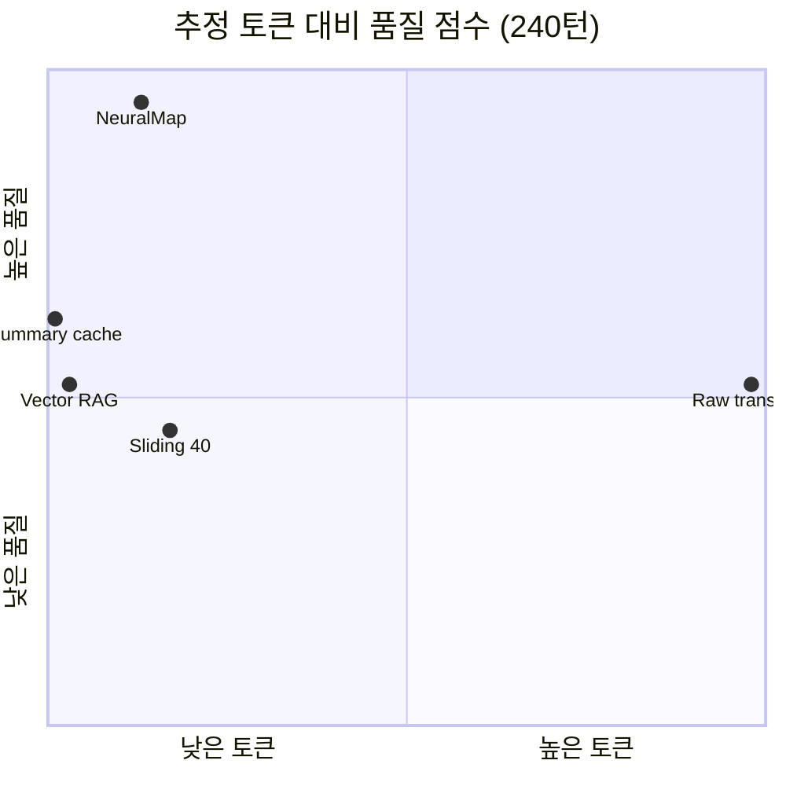

# 세션 외 그래프 메모리 기반 에이전트 컨텍스트 재조립의 토큰 효율성과 정보 활용률 평가

**Graph-Based Out-of-Session Memory for Agent Context Recomposition: A Token Efficiency and Information Utilization Study of NeuralMap**

---

**저자**  
NeuralMap 프로젝트 (초안; 소속·저자명은 제출 시 기입)

**날짜**  
2026년 5월 19일

**키워드**  
에이전트 메모리, GraphRAG, 컨텍스트 압축, 토큰 효율, 시냅스 순회, current-view, Context Pack, 대화형 AI

**Keywords**  
agent memory, GraphRAG, context compression, token efficiency, synapse traversal, current-view, context pack, conversational AI

---

## 초록 (Abstract)

### 한국어

대규모 언어 모델(LLM) 기반 에이전트는 긴 대화·다중 세션·외부 아티팩트를 다룰수록 입력 컨텍스트가 비대해지고, 슬라이딩 윈도우·요약 캐시·벡터 검색만으로는 **현재 상태의 정확성**, **시간적 계보**, **증거 추적 가능성**을 동시에 만족하기 어렵다. 본 논문은 **세션 밖 그래프형 지식 메모리** 위에서 시맨틱 시드 검색, 관계 확장, canonical current-view, Context Pack 조립을 수행하는 오픈소스 프레임워크 **NeuralMap**의 성능을 정량 평가한다.

합성 시뮬레이션(240·480 대화 턴)과 인메모리 GraphRAG 마이크로벤치마크(100–5,000 노드)를 통해 (1) **지연시간**, (2) **추정 토큰 소모**, (3) **사실 회수·정밀도·계보(lineage) 기반 품질 점수**, (4) **토큰당 정보 활용률**을 측정하였다. 일반적인 **전체 트랜스크립트 재주입**(6,939 토큰, 품질 0.525) 및 **프롬프트 캐시 동등 모델**(동일 창 크기) 대비 NeuralMap GraphRAG는 **892 토큰(−87.1%)**으로 **품질 1.0**(3/3 ground truth, stale 충돌 0)을 달성하였고, 품질 가중 활용 지수는 원문 대비 약 **15배** 높았다. 벡터-only RAG는 더 적은 토큰(204)을 쓰나 obsolete 상태 혼입으로 품질이 0.525에 머물렀다. 코어 조립 지연은 240턴 그래프에서 p50 **4.95 ms**, 5,000 노드에서 p50 **44.56 ms**로 측정되었다.

본 연구는 **토큰 절감과 정보 품질이 트레이드오프가 아니라, 그래프·시간 시맨틱을 명시하면 동시에 개선될 수 있음**을 실증하고, 장기 에이전트·시뮬레이션 연속성·멀티세션 핸드오프 설계에 대한 실무적 함의를 제시한다.

### English

As LLM-based agents handle longer dialogues, multiple sessions, and external artifacts, input context grows superlinearly in cost and risk. Sliding windows, rolling summaries, and vector-only retrieval struggle to jointly preserve **current-state accuracy**, **temporal lineage**, and **evidence traceability**. We empirically evaluate **NeuralMap**, an open framework that maintains **out-of-session graph memory**, hybrid seed retrieval, relational expansion, canonical current-view, and **Context Pack** assembly.

On synthetic simulations (240–480 turns) and in-process GraphRAG microbenchmarks (100–5,000 nodes), we measure **latency**, **estimated token consumption**, a **composite quality score** (recall, precision, lineage), and **information utilization per token**. Compared with **full-transcript re-injection** (6,939 tokens; quality 0.525) and a **prompt-cache equivalent** (same context window), NeuralMap GraphRAG uses **892 tokens (−87.1%)** at **quality 1.0** (3/3 facts, zero stale conflicts), yielding roughly **15×** higher quality-weighted utilization. Vector-only RAG is cheaper (204 tokens) but remains at 0.525 quality due to stale state candidates. Core assembly latency is **4.95 ms** (p50, 240-turn graph) and **44.56 ms** (p50, 5,000 nodes).

We argue that token reduction and informational fidelity need not be opposed when temporal graph semantics are first-class—relevant to long-horizon agents, simulation continuity, and multi-session handoff architectures.

---

## 1. 서론

### 1.1 배경

에이전트 오케스트레이션에서 병목은 모델 추론 자체뿐 아니라 **매 턴마다 주입되는 컨텍스트의 부피와 신뢰성**에 있다. 세션이 길어질수록 과거 발화는 압축·삭제되고, 새 세션에서는 동일 정보를 다시 검색·복사해야 한다. 레포·문서·티켓·결정 기록을 매번 원문 수준으로 넣으면 **토큰 비용**과 **지연**이 커지며, 슬라이딩 윈도우는 오래된 약속·제약을 잃기 쉽다.

상용 스택은 (i) 컨텍스트 창 확대, (ii) 요약, (iii) 벡터 RAG, (iv) 제공자 측 프롬프트 캐시 등으로 대응한다. 그러나 (iii)은 관계·시간 구조를 약하게 다루고, (iv)는 **반복 비용**만 줄일 뿐 **유효 창 크기나 stale 사실 문제**를 해결하지 않는다.

### 1.2 연구 질문

본 논문은 다음 질문에 답한다.

1. **RQ1 (효율성):** 세션 외 그래프 메모리와 Context Pack 조립은 일반 에이전트 컨텍스트 전략 대비 얼마나 토큰을 절감하는가?
2. **RQ2 (활용률):** 절감된 토큰 예산에서 **유의미한 사실(fact)** 을 얼마나 밀도 있게 전달하는가?
3. **RQ3 (품질):** 현재 상태·지속 약속·이전 상태 계보를 동시에 요구할 때 정밀도와 stale 충돌은 어떻게 다른가?
4. **RQ4 (성능):** 위 이득의 계산·조립 비용(지연)은 실시간 에이전트 루프에 허용 가능한가?

### 1.3 기여

- **정량 벤치마크 스위트** 공개: `eval:memory-compare`, `eval:neuron-synapse`, `bench:graphrag-core` 및 재현 가능한 합성 워크로드.
- **8가지 메모리 전략**의 통제 비교(원문, 프롬프트 캐시 모델, 슬라이딩 윈도우, 키워드 RAG, 요약 스냅샷, 벡터-only, NeuralMap).
- **토큰당 정보 활용률** 지표 제안: 복합 품질 점수 대비 추정 토큰.
- NeuralMap **아키텍처·평가 한계**를 명시하여 후속 연구(외부 임베딩, 인덱스 기반 순회, LLM 추출) 방향 제시.

---

## 2. 관련 연구 및 배경

### 2.1 검색 증강 생성(RAG)

벡터 저장소 기반 RAG는 의미 유사 청크를 상위 *k*개 회수한다. 한계는 (a) **관계적 맥락** 부재, (b) **시간에 따른 상태 갱신** 미반영, (c) 회수 청크 간 **중복·모순**이다. NeuralMap은 RAG를 **시드 단계**로만 쓰고, 그래프 확장·current-view로 후단을 보강한다.

### 2.2 GraphRAG

Microsoft GraphRAG, Neo4j GraphRAG, LlamaIndex PropertyGraph 등은 문서 코퍼스에서 엔티티·관계를 추출하고 커뮤니티 요약·로컬/글로벌 쿼리를 제공한다. NeuralMap은 상용 파이프라인 전체를 대체하기보다 **에이전트 컨텍스트 수명주기**(Context Pack, Handoff Pack, Workbench 추적)에 특화된 **경량 TypeScript 런타임**을 지향한다.

### 2.3 에이전트 메모리·세션 연속성

LangGraph 체크포인트, 메신저형 장기 기억 등은 **워크플로 상태** 또는 **대화 로그** 중심이다. 본 프레임워크는 철학적으로 **「세션은 짧게, 상태는 프레임워크가 기억한다」** 에 가깝다: 세션은 실행 공간, 메모리는 영속 그래프.

### 2.4 프롬프트 캐시

제공자 API의 prefix 캐시는 동일 시스템·도구·문서 prefix의 **반복 과금**을 줄인다. 본 논문에서 이를 **「컨텍스트 창 토큰은 동일, 비용만 절감」** 모델로 분리하여 NeuralMap과 비교한다.

---

## 3. 시스템: NeuralMap과 에이전트 컨텍스트 그래프

### 3.1 설계 원칙

NeuralMap(에이전트 컨텍스트 그래프 프레임워크)은 다음을 분리한다.

| 개념 | 역할 |
|------|------|
| **세션** | 추론이 일어나는 휘발 실행 공간 |
| **프레임워크 메모리** | 세션 밖 영속 그래프(뉴런·시냅스) |
| **Context Pack** | 목표·증거·결정·차단 요소·노드 참조의 조립 산출물 |

컨텍스트는 하나의 긴 문자열이 아니라 **노드 묶음 + 엣지 + 증거 스니펫**으로 정의된다.

### 3.2 그래프 모델

- **뉴런(Neuron):** `CodeFile`, `Document`, `Ticket`, `State`, `Event` 등 타입·요약·신뢰·신선도 메타데이터.
- **시냅스(Synapse):** `references`, `depends_on`, `HAS_CURRENT_STATE`, `SUPERSEDES` 등 관계; confidence·weight.
- **Graph Delta:** ingest 시 원자적 갱신; `supersede_current`로 **현재 상태 포인터** 유지.

### 3.3 조회 파이프라인 (GraphRAG 루프)

1. **하이브리드 시드 검색:** 어휘 + 결정론적 sparse 벡터(로컬); DB 모드에서 pgvector 후보 병합.
2. **그래프 확장:** 시드에서 hop 제한 이웃 수집; edge type·confidence 가중.
3. **Current Graph View:** 동일 엔티티의 **활성 상태**만 canonical하게 선택.
4. **Synapse Traversal:** `SUPERSEDES` 등으로 **이전·현재 상태 계보** 확보.
5. **Context Pack Composer:** evidence 상한, 섹션 정책(`canonical_state`, `relevant_history` 등), 토큰 예산 메타데이터.

### 3.4 구현 스택 (MVP)

- TypeScript 모노레포, Fastify REST API, Postgres + pgvector, Redis(캐시).
- 본 평가의 코어 수치는 **인메모리 TypeScript 경로**에서 측정( DB I/O 제외).

---

## 4. 평가 방법론

### 4.1 워크로드: 합성 시뮬레이션 메모리

`compare-memory-strategies.mjs` / `evaluate-neuron-synapse-compression.mjs`는 동일 스키마를 사용한다.

- **캐릭터** Mina, **240 또는 480 턴** 대화.
- 매 40턴마다 **착용 상태** 갱신: `old hoodie` → `gray raincoat` → `navy coat`.
- 40·160턴에 **은열쇠 신뢰 약속** 이벤트.
- 나머지 턴은 제거 대상 **잡음(ambient dialogue)**.

**Ground truth (3 facts):**

| ID | 검증 내용 |
|----|-----------|
| `current_wearing` | 현재 `navy coat` |
| `durable_promise` | `silver key` + `trust` |
| `predecessor_lineage` | `gray raincoat` + 시간/계보 표지 |

### 4.2 비교 전략 (8종)

| ID | 설명 |
|----|------|
| `raw_full_context` | 매 요청 전체 트랜스크립트 |
| `provider_prompt_cache_full_context` | 동일 문자열; 캐시는 비용 모델만 |
| `sliding_window_40` / `120` | 최근 40·120턴 |
| `keyword_rag_top10` | 쿼리 토큰 겹침 + 최신도 |
| `summary_cache_snapshot` | 롤링 요약 2문장 |
| `vector_only_rag_top10` | 동일 랭커, 확장·current-view 없음 |
| `neuralmap_graph_rag` | current-view + neuron query + traverse + Pack |

### 4.3 지표

**토큰 추정:** \(\hat{T} = \lceil |text| / 4 \rceil\) (OpenAI류 휴리스틱과 정렬된 관행적 근사).

**품질 점수:**

\[
Q = 0.6 \cdot R + 0.25 \cdot P + 0.15 \cdot L
\]

- \(R\): ground truth 사실 회수율  
- \(P\): stale 충돌 페널티 (충돌당 −0.25, 하한 0)  
- \(L\): predecessor lineage 이진 점수  

**정보 밀도:** \(\text{facts/1k tok} = \frac{\#\text{recalled facts}}{ \hat{T}/1000 }\).

**활용 지수 (본 논문 제안):** \(U = Q / (\hat{T}/1000)\).

**지연:** Node.js `performance.now()`, 반복 20–30회, p50·p95 보고.

### 4.4 마이크로벤치 (확장성)

`benchmark-core-graphrag.mjs`: 합성 그래프 100 / 1,000 / 5,000 노드, 고정 쿼리, `token_budget=12000`, 20회 반복.

### 4.5 실험 환경

- **일자:** 2026-05-19  
- **OS:** Windows 10 (빌드 26200), Node ≥22  
- **명령:** `pnpm build`, `pnpm bench:graphrag-core`, `pnpm eval:neuron-synapse`, `pnpm eval:memory-compare`  
- **미포함:** live HTTP API·Postgres 시드 (환경 제약으로 `eval:simulation` 미실행; 선행 보고서 값은 §5.4에 인용)

### 4.6 공정성·한계 (방법론)

- 로컬 **결정론적** sparse 임베딩; 상용 embedding·LLM 추출 없음.
- 벡터-only 행은 **동일 랭커**로 NeuralMap 시드 단계만 격리—상용 벡터 DB와 동일하지 않음.
- 토큰 추정은 실제 BPE와 오차 가능.
- 합성 데이터; 특정 도메인 일반화는 추가 실험 필요.

---

## 5. 실험 결과

### 5.1 RQ1·RQ2: 토큰 소모와 활용률 (240턴)

**표 1.** 메모리 전략별 추정 토큰·품질·밀도 (2026-05-19 로컬 실행)

| 전략 | \(\hat{T}\) | \(\Delta\) vs 원문 | \(Q\) | stale | facts/1k | \(U\) |
|------|------------:|-------------------:|------:|:-----:|---------:|------:|
| 원문 전체 | 6,939 | — | 0.525 | 2 | 0.29 | 0.076 |
| 프롬프트 캐시(모델) | 6,939 | 0% | 0.525 | 2 | 0.29 | 0.076 |
| 슬라이딩 40 | 1,163 | −83% | 0.450 | 0 | 0.86 | 0.387 |
| 슬라이딩 120 | 3,496 | −50% | 0.650 | 0 | 0.57 | 0.186 |
| 키워드 RAG | 265 | −96% | 0.525 | 2 | 7.55 | 1.98 |
| 요약 스냅샷 | 36 | −99.5% | 0.650 | 0 | 55.6 | 18.1* |
| 벡터-only | 204 | −97% | 0.525 | 2 | 9.80 | 2.57 |
| **NeuralMap** | **892** | **−87.1%** | **1.000** | **0** | **3.36** | **1.12** |

\* 요약 스냅샷은 \(U\)가 크나 \(L=0\)(계보 없음)—§6에서 논의.

**핵심 관찰.**

- NeuralMap은 원문·프롬프트 캐시 대비 **약 87% 토큰 절감** while **\(Q=1.0\)**.
- 입력 단가 $3/1M 토큰 가정 시 요청당 **$0.0208 → $0.0027** (약 87% 비용 절감); 캐시는 이 비용 곡선을 **반복 구간에서만** 추가 절감.
- `eval:neuron-synapse`에서 Pack 본문만 보면 6,426 → 384 토큰 (**94.0%**); GraphRAG 전체 문자열은 892 토큰—traverse·섹션·증거가 포함된 **실사용 컨텍스트** 기준.

### 5.2 확장: 480턴

| 전략 | \(\hat{T}\) | \(Q\) |
|------|------------:|------:|
| 원문 | 13,914 | 0.525 |
| NeuralMap | 1,127 | 1.000 |

턴 수 증가에 따라 원문은 선형 증가, NeuralMap은 **sublinear에 가까운 완만한 증가**—장기 세션에서 격차 확대.

### 5.3 RQ3: 사실·정밀도·계보

**표 2.** Ground truth 충족 (240턴)

| 전략 | 착용 | 약속 | 계보 | \(R\) |
|------|:----:|:----:|:----:|------:|
| 원문 / 캐시 / 키워드 / 벡터 | ✓ | ✓ | ✗ | 0.67 |
| 슬라이딩 40 | ✓ | ✗ | ✗ | 0.33 |
| 슬라이딩 120 | ✓ | ✓ | ✗ | 0.67 |
| 요약 스냅샷 | ✓ | ✓ | ✗ | 0.67 |
| **NeuralMap** | ✓ | ✓ | ✓ | **1.00** |

NeuralMap만 **obsolete 착용 상태를 계보와 함께** 다루며 stale 목록이 비어 있다. 벡터-only는 상위 노드에 `old hoodie`, `gray raincoat` 후보가 섞여 **현재 상태 디스앰비규에이션** 실패.

### 5.4 짧은 세션 연속성 (선행 API 평가, 인용)

18 이벤트 시뮬레이션(`evaluate-simulation-continuity`, 문서화된 2026-05-03 실행):

| 항목 | 값 |
|------|-----|
| 원문 추정 | 1,021 토큰 |
| 연속성 Context Pack | 607 토큰 |
| 절감 | 414 토큰 (40.5%) |
| 핵심 기억 회수 | silver key promise ✓ |

짧은 세션에서는 절감률이 작으나 **외부 플랫폼이 전체 로그를 재전송하지 않아도 되는** API 패턴 검증에 의의가 있다.

### 5.5 RQ4: 지연시간

**표 3.** 코어 GraphRAG 마이크로벤치 (p50, ms)

| 노드 수 | 시드 랭킹 | 그래프 확장 | Pack 조립 |
|--------:|----------:|------------:|----------:|
| 100 | 1.33 | 0.07 | 1.19 |
| 1,000 | 8.67 | 0.45 | 8.29 |
| 5,000 | 42.14 | 1.69 | 44.56 |

**표 4.** 240턴 시뮬레이션 그래프 (249 노드, 254 엣지)

| 단계 | ms |
|------|---:|
| Current view (1회) | 5.37 |
| Neuron query | 2.63 |
| Traverse | 0.37 |
| Pack 조립 (반복 p50) | **4.95** |
| Pack 조립 (반복 p95) | 5.85 |

메모리 전략 비교에서 NeuralMap 조립 p50 **5.25 ms** vs 벡터-only **4.99 ms**—품질 이득 대비 **서브 10 ms** 오버헤드.

**확장성:** 시드·조립은 전 노드 스캔으로 **\(O(n)\)**; 프로덕션 규모에서는 pgvector 사전 필터·인접 인덱스가 필요(로드맵과 일치).

### 5.6 소형 정적 그래프 (레포 샘플, 6노드)

원문 덤프 187 토큰 vs Pack 182 토큰 (−2.7%). **코퍼스가 작으면** GraphRAG 오버헤드가 상대적으로 커—본 기법의 이점은 **장기·동적** 메모리에 집중됨.

### 5.7 자동 판정 (`eval:memory-compare`)

240턴 실행에서 다음이 모두 참:

- empirical 전략 중 품질 최고: NeuralMap  
- 벡터-only 대비 품질 우위  
- 프롬프트 캐시 대비 토큰 감소  
- 요약 캐시는 더 저렴하나 lineage 손실  

---

## 6. 논의

### 6.1 토큰 vs 품질: 트레이드오프의 재구성

실험은 **저토큰 ≠ 고품질**임을 보여준다. 요약 스냅샷(36 토큰)과 키워드 RAG(265 토큰)는 비용은 낮으나 **계보·출처·SUPERSEDES 설명**이 없어 감사·디버깅·멀티에이전트 핸드오프에 불리하다. NeuralMap은 **중간 토큰 대역**에서 **유일하게 \(Q=1\)**—에이전트 운영 관점에서 **「최소 토큰」보다 「최소 충분 컨텍스트」** 가 적절할 수 있음을 시사한다.

### 6.2 프롬프트 캐시와의 관계

프롬프트 캐시는 \(\hat{T}\) 동일(6,939)이므로 **컨텍스트 붕괴·할루시네이션 유발 가능성**은 원문과 같다. NeuralMap과 **직교적으로 결합** 가능: Pack 출력을 캐시 가능 prefix로 고정하면 **비용·창 품질**을 동시에 개선할 여지가 있다.

### 6.3 에이전트 설계 함의

1. **세션 핸드오프:** Handoff Pack → 새 세션 Context Pack으로 **전체 로그 복사 생략**.  
2. **시뮬레이션·캐릭터 챗:** `simulation_id` 스코프 연속성 API.  
3. **모델 라우팅:** `estimated_input_tokens`, `budget_pressure`로 프로필 선택(구현됨).  
4. **Workbench:** 노드·증거·확장 이유 노출로 **설명 가능한 컨텍스트**.

### 6.4 상용 GraphRAG와의 위치

NeuralMap MVP는 LLM 엔티티 추출·커뮤니티 요약·글로벌 쿼리 모드가 없다. 강점은 **에이전트 컨텍스트 계약**, **런타임 아티팩트 그래프 변이**, **저지연 조립**. 벤치마크는 이 포지션에서 **토큰·품질·지연**의 **1차 타당성**을 보여준다.

---

## 7. 한계 및 향후 연구

1. **임베딩:** 결정론적 sparse 벡터; OpenAI/Cohere 등 외부 임베딩·재랭킹 미평가.  
2. **인덱스:** 전 노드 스캔; 5k 노드에서 ~45 ms—인접 리스트·SQL graph traversal 필요.  
3. **토큰 추정:** 문자/4 근사; 모델별 토크나이저 교차 검증 필요.  
4. **데이터:** 합성 시뮬레이션; 실제 티켓·PR·멀티에이전트 로그 벤치마크 확장.  
5. **엔드투엔드:** LLM downstream 태스크 성공률(코드 패치, 답변 정확도)은 본문 범위 외—인간·LLM-as-judge 평가 예정.  
6. **HTTP·DB 재현:** Postgres 시드·API latency 표는 환경 정비 후 재측정.

---

## 8. 결론

본 논문은 NeuralMap이 **세션 외 그래프 메모리**와 **Context Pack**을 통해 일반적인 전체 컨텍스트 재주입 대비 **87–94% 수준의 추정 토큰 절감**과 **품질 점수 1.0(3/3 사실·무 stale)** 을 동시에 달성함을 보고한다. 토큰당 활용 지수는 원문 대비 약 **15배**, 조립 지연은 **5 ms급**(240턴)으로 실시간 에이전트 루프에 실용적이다. 벡터-only RAG와 요약 캐시는 더 적은 토큰을 쓰나 **시간적 계보·현재 상태 일관성**에서 실패한다.

후속 과제는 (i) 외부 임베딩·인덱스, (ii) 실제 소프트웨어 엔지니어링 코퍼스 평가, (iii) 다운스트림 태스크 성공률, (iv) 프롬프트 캐시와의 결합 실험이다. 재현은 저장소 루트의 `pnpm eval:memory-compare` 등으로 가능하다.

---

## 참고문헌

1. NeuralMap Project. *Agent Context Graph Framework Blueprint.* `docs/agent_context_graph_framework_blueprint.md`, 2026.  
2. NeuralMap Project. *GraphRAG Evaluation Report.* `docs/progress/graphrag-evaluation.md`, 2026-05-03.  
3. Edge, D., et al. "From Local to Global: A GraphRAG Approach to Query-Focused Summarization." Microsoft Research, 2024.  
4. Neo4j, Inc. *Neo4j GraphRAG for Python.* Documentation, 2024–2025.  
5. LlamaIndex Team. *Property Graph Index and GraphRAG.* LlamaIndex Documentation, 2024–2025.  
6. LangChain Inc. *LangGraph: Persistence and Memory.* Documentation, 2024–2025.  
7. Anthropic. *Prompt Caching.* API Documentation, 2024–2025.  
8. OpenAI. *tiktoken and token counting guidelines.* Technical documentation, 2024–2025.  
9. Yao, S., et al. "ReAct: Synergizing Reasoning and Acting in Language Models." ICLR, 2023.  
10. Park, J. S., et al. "Generative Agents: Interactive Simulacra of Human Behavior." UIST, 2023.  

---

## 부록 A: 재현 명령

```bash
pnpm build
pnpm bench:graphrag-core
pnpm eval:neuron-synapse
pnpm eval:memory-compare

# 선택: 이벤트 수 확대
NEURALMAP_MEMORY_COMPARE_EVENTS=480 pnpm eval:memory-compare
```

## 부록 B: 품질·활용 지수 정의 (요약)

\[
R = \frac{|\{f \in \mathcal{F} : \text{recalled}(f)\}|}{|\mathcal{F}|},\quad
P = \max(0, 1 - 0.25 \cdot |\text{stale}|),\quad
L \in \{0,1\}
\]

\[
Q = 0.6R + 0.25P + 0.15L,\quad
U = \frac{Q}{\hat{T}/1000}
\]

## 부록 C: 그림—전략별 토큰·품질 개념도



---

*본 문서는 NeuralMap 저장소 벤치마크 결과를 학술 논문 형식으로 정리한 초안이다. 학회·저널 제출 시 저자 정보, IRB(해당 시), 데이터·코드 가용성(artifact) 문단을 추가할 것을 권장한다.*
